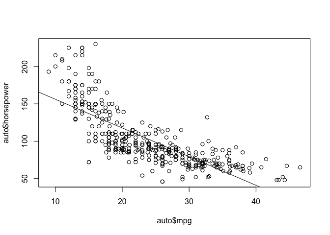
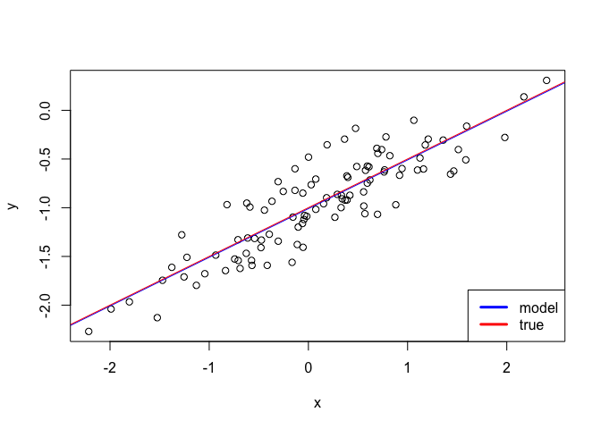
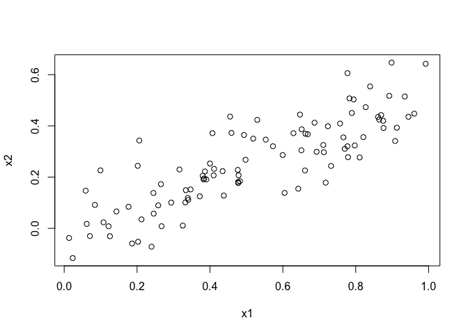
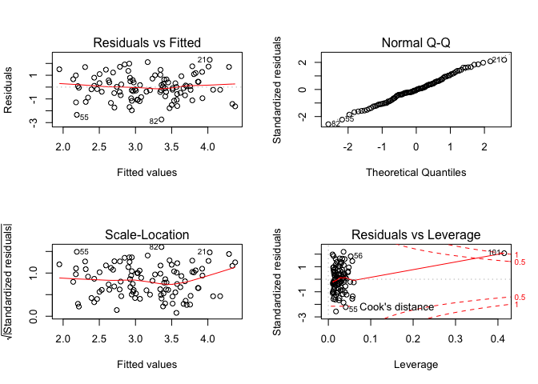
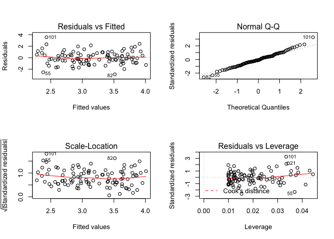
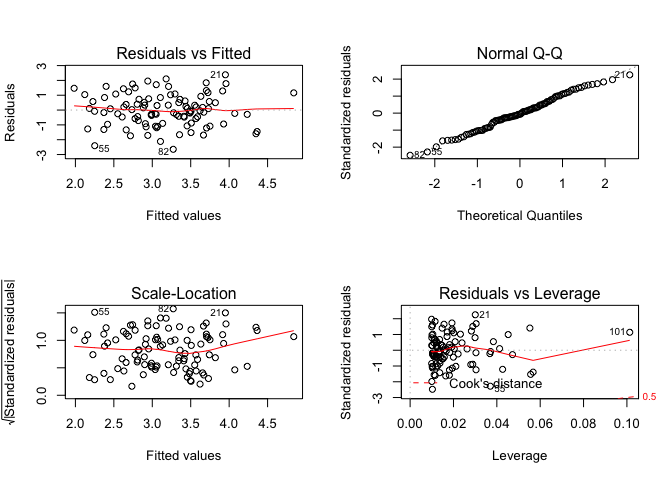
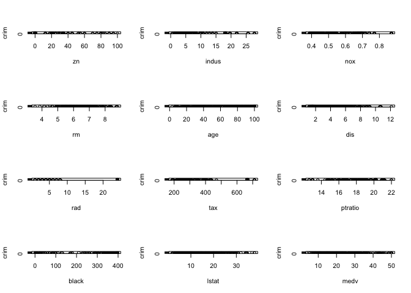
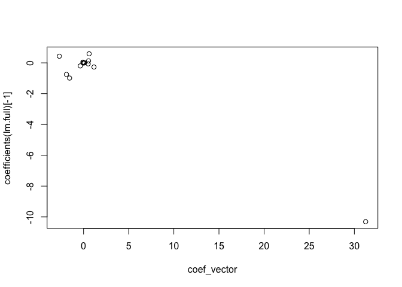

ISLR Chapter 3 solutions
================

## Exercise 1

**Describe the null hypotheses to which the p-values given in Table 3.4
correspond. Explain what conclusions you can draw based on these
p-values. Your explanation should be phrased in terms of sales, TV,
radio, and newspaper, rather than in terms of the coefficients of the
linear model.**

The null hypotheses to which the p-values for `TV`, `radio` and
`newspaper` corresponds are that any change in these advertising budgets
have a zero effect on the response, `sales`. From these p-values, we can
reject the null hypotheses for both `TV` and `radio` - for instance, we
can conclude to a high level of confidence that a $1,000 increase in the
TV advertising budget leads to a further 189 units sold. Similarly, a
$1,000 increase in the radio advertising budget will lead to a further
46 units sold. Given the size of the p-value for newspaper advertising
budget, we cannot reject the null hypothesis.

## Exercise 2

**Carefully explain the differences between the KNN classifier and KNN
regression methods.**

In effect, both the classification and regression applications of KNN
perform the same calculation, averaging over *K* points nearest to the
test case that we want to predict. However, the prediction output is
different - while the regression method outputs a prediction of the
actual value, the classifier can be interpreted probabilistically.

The KNN classifier takes the *K* points nearest to the test observation
to estimate the class of the test point. For instance, if *K* is 3, then
it will take the nearest three points and calculate the fraction of
these three points fall in the class we are trying to predict. For
instance, if one of these points is of this class, it will estimate the
probability as on third. In a two-class problem, this is not above the
50% decision boundary so the test case will be classified as the other
class.

KNN applied to regression takes the *K* nearest neighbours and take the
mean average over these points to give a prediction of a test case. If,
for instance, *K* is 3, and each point has a value of 1, 2, and 3 for
the response variable, KNN will output the the mean of these values, 2,
as the prediction.

## Exercise 3

**Suppose we have a data set with five predictors,
 = GPA,
 = IQ,
 = Gender (1 for
Female and 0 for Male),  = Interaction between GPA and IQ, and
 = Interaction
between GPA and Gender. The response is starting salary after graduation
(in thousands of dollars). Suppose we use least squares to fit the
model, and get
 = 50,
 = 20,
 = 0.07,
 = 35,
 = 0.01,
 = -10.**

**Which answer is correct and why?**

**i. For a fixed value of IQ and GPA, males earn more on average than
females.**

**ii. For a fixed value of IQ and GPA, females earn more on average than
males.**

**iii. For a fixed value of IQ and GPA, males earn more on average than
females provided that the GPA is high enough.**

**iv. For a fixed value of IQ and GPA, females earn more on average than
males provided that the GPA is high enough.**

The model described is:   
  

The interaction term means that if the GPA is sufficiently high, then
where gender is female this will reduce salary below where it is male.
Where GPA is low, however, the interaction term has much less of an
effect, and the coefficient on the gender variable means women will earn
more than men. Therefore, option iii, where men earn more than women
where GPA is sufficiently high, is the correct answer.

**Predict the salary of a female with IQ of 110 and a GPA of 4.0.**

``` r
y <- 50 + 20*4 + 0.07*110 + 35*1 + 0.01*4*110 - 10*4*1
y
```

    ## [1] 137.1

**True of false: Since the coefficient for the GPA/IQ interaction term
is very small, there is very little evidence of an interaction effect.
Justify your answer.**

False: statistical significance can be determined by inspecting the
p-values of each coefficient. The size of coefficients themselves are
determined by the units of measurement and do not indicate significance.

## Exercise 4

**I collect a set of data (*n*** **= 100 observations) containing a
single predictor and a quantitative response. I then fit a linear
regression model to the data, as well as a separate cubic regression,
i.e. *.***

**(a) Suppose that the true relationship between** ***X*** **and**
***Y*** **is linear, i.e.** ***$Y = .*** **Consider the training residual
sum of squares (RSS) for the linear regression, and also the training
RSS for the cubic regression. Would we expect one to be lower than the
other, would we expect them to be the same, or is there not enough
information to tell? Justify your answer.**

We would expect the training RSS to be lower in the model with the cubic
term than that with the single predictor even if the actual relationship
is linear. Simply adding extra variables will result in a lower training
RSS as the model would overfit the training data.

**(b) Answer part (a) using test rather than training RSS.**

In contrast, the test RSS will be lower for the single predictor model
because this more closely fits the actual relationship - the increased
bias in the simple linear regression would be more than offset by the
decrease in variance.

**(c) Suppose that the true relationship between** ***X*** **and**
***Y*** **is not linear, but we do not know how far it is from linear.
Consider the training residual sum of squares (RSS) for the linear
regression, and also the training RSS for the cubic regression. Would we
expect one to be lower than the other, would we expect them to be the
same, or is there not enough information to tell? Justify your answer.**

If the actual relationship is non-linear, we would expect the training
RSS of the cubic term to be less than the training RSS of the simple
model, regardless of how non-linear it is for the same reason outlined
above.

**(d) Answer part (c) using test rather than training RSS.**

For the test RSS we do not have enough information to say either way
because if the relationship is only slightly non-linear, the linear
model may be a good approximation of the true function. It isn’t clear
whether the higher variance of the cubic model or greater bias of the
linear model would result in higher test RSS without further
information.

# Exercise 5

**Consider the fitted values that result from performing linear
regression without an intercept. In this setting, the** ***i*th fitted
value takes the form:**

  
  

**where**

  
  

**Show that we can write:**

  
  

Substituting for
:

  
  

Let:

  
  

Therefore we can write:

  
  

# Exercise 6

**Using (3.4), argue that in the case of simple linear regression, the
least squares line always passes through the point** ***()*.**

The intercept in the simple linear regression case is:   
  
The regression line can be written as:   
  

As a simple regression is linear, there must be a point on the
regression line that passes through
. Substituting for

we can see that where  we have the following:

  
  

Hence, where the regression line passes through
, it must at this point also pass through
, and hence the regression line must pass through
").

# Exercise 7

**It is claimed in the text that in the case of simple linear regression
of** ***Y*** **onto** ***X*, the
 statistic is
equal to the square of the correlation bewteen** ***X*** **and** ***Y*.
Prove that this is the case. For simplicity, you may assume that
.**

 is defined as:
  
  

Under the assumption of zero means for X and Y, we know the following:

  
  
  
  
  
  
  
^2} = \\sum_{i=1}^n{(y_i^2-2\\beta_1x_iy_i+\\beta_1^2x_i^2)}")  
Substituting for
,
we can write this expression for
 as follows:

  
}")  
  
^2}{\\sum_{i=1}^nx_i^2}+\\sum_{i=1}^n\\beta_1^2x_i^2 \\\\")  
  
  
  
  

Correlation between X and Y is defined as follows:   
 = \\frac{\\sum_{i=1}^nx_iy_i}{\\sqrt{\\sum_{i=1}^nx_i^2}\\sqrt{\\sum_{i=1}^ny_i^2}}
")  

Squaring and substituting in
:

  
^2 = \\frac{(\\sum_{i=1}^nx_iy_i)^2}{\\sum_{i=1}^nx_i^2\\sum_{i=1}^ny_i^2}")  
  
^2}{\\sum_{i=1}^nx_i^2\\sum_{i=1}^ny_i^2}")  
  
  
  
  
  
  
  
  
  
  

# Exercise 8

Use the `lm()` function to perform a simple linear regression with `mpg`
as the response and `horsepower` as the
predictor:

``` r
auto <- read.csv("http://faculty.marshall.usc.edu/gareth-james/ISL/Auto.csv", header = TRUE, na.strings = "?")

fit <- lm(mpg ~ horsepower, data = auto)
summary(fit)
```

    ## 
    ## Call:
    ## lm(formula = mpg ~ horsepower, data = auto)
    ## 
    ## Residuals:
    ##      Min       1Q   Median       3Q      Max 
    ## -13.5710  -3.2592  -0.3435   2.7630  16.9240 
    ## 
    ## Coefficients:
    ##              Estimate Std. Error t value Pr(>|t|)    
    ## (Intercept) 39.935861   0.717499   55.66   <2e-16 ***
    ## horsepower  -0.157845   0.006446  -24.49   <2e-16 ***
    ## ---
    ## Signif. codes:  0 '***' 0.001 '**' 0.01 '*' 0.05 '.' 0.1 ' ' 1
    ## 
    ## Residual standard error: 4.906 on 390 degrees of freedom
    ##   (5 observations deleted due to missingness)
    ## Multiple R-squared:  0.6059, Adjusted R-squared:  0.6049 
    ## F-statistic: 599.7 on 1 and 390 DF,  p-value: < 2.2e-16

There is a relationship between the predictor and response: the results
suggest that with a one unit increase in `horsepower`, `mpg` decreases
by 0.16. The relationship is hence negative. The low p-value on the
coefficient and high F-statistic suggests that this result is highly
statistically significant - we cannot reject the null hypothesis that
there is no relationship between the response and predictor. The
 of 0.6 suggests
the model explains about 60% of the variance in the data.

The predicted `mpg` associated with a `horsepower` of 98 is:

``` r
predict(fit, newdata = data.frame(horsepower = 98))
```

    ##        1 
    ## 24.46708

The 95% confidence interval
is:

``` r
predict(fit, newdata = data.frame(horsepower = 98), interval = "confidence")
```

    ##        fit      lwr      upr
    ## 1 24.46708 23.97308 24.96108

The 95% prediction interval
is:

``` r
predict(fit, newdata = data.frame(horsepower = 98), interval = "prediction")
```

    ##        fit     lwr      upr
    ## 1 24.46708 14.8094 34.12476

Plotting the response and predictor, with the regression line:

``` r
plot(auto$mpg, auto$horsepower)
abline(lm(auto$horsepower ~ auto$mpg))
```

<!-- -->

Plotting diagnostics:

``` r
par(mfrow = c(2,2))
plot(fit)
```

<!-- -->

The residuals vs fitted plot suggests a non-linear relationship in the
data. This could be addressed by transforming the predictors. There are
a few points, notably observations 117 and 94, that have high leverage
and hence have a significant influence on the regression line. There do
not appear to be any outliers in the data.

# Exercise 9

First, produce pairwise scatter plots:

``` r
pairs(auto)
```

<!-- -->

Now create a correlation
    matrix:

``` r
cor(auto[, -9])
```

    ##                     mpg  cylinders displacement horsepower     weight
    ## mpg           1.0000000 -0.7762599   -0.8044430         NA -0.8317389
    ## cylinders    -0.7762599  1.0000000    0.9509199         NA  0.8970169
    ## displacement -0.8044430  0.9509199    1.0000000         NA  0.9331044
    ## horsepower           NA         NA           NA          1         NA
    ## weight       -0.8317389  0.8970169    0.9331044         NA  1.0000000
    ## acceleration  0.4222974 -0.5040606   -0.5441618         NA -0.4195023
    ## year          0.5814695 -0.3467172   -0.3698041         NA -0.3079004
    ## origin        0.5636979 -0.5649716   -0.6106643         NA -0.5812652
    ##              acceleration       year     origin
    ## mpg             0.4222974  0.5814695  0.5636979
    ## cylinders      -0.5040606 -0.3467172 -0.5649716
    ## displacement   -0.5441618 -0.3698041 -0.6106643
    ## horsepower             NA         NA         NA
    ## weight         -0.4195023 -0.3079004 -0.5812652
    ## acceleration    1.0000000  0.2829009  0.2100836
    ## year            0.2829009  1.0000000  0.1843141
    ## origin          0.2100836  0.1843141  1.0000000

Performing a multiple linear regression with `mpg` as response and all
other predictors as response:

``` r
fit <- lm(mpg ~ ., data = auto[,-9])
summary(fit)
```

    ## 
    ## Call:
    ## lm(formula = mpg ~ ., data = auto[, -9])
    ## 
    ## Residuals:
    ##     Min      1Q  Median      3Q     Max 
    ## -9.5903 -2.1565 -0.1169  1.8690 13.0604 
    ## 
    ## Coefficients:
    ##                Estimate Std. Error t value Pr(>|t|)    
    ## (Intercept)  -17.218435   4.644294  -3.707  0.00024 ***
    ## cylinders     -0.493376   0.323282  -1.526  0.12780    
    ## displacement   0.019896   0.007515   2.647  0.00844 ** 
    ## horsepower    -0.016951   0.013787  -1.230  0.21963    
    ## weight        -0.006474   0.000652  -9.929  < 2e-16 ***
    ## acceleration   0.080576   0.098845   0.815  0.41548    
    ## year           0.750773   0.050973  14.729  < 2e-16 ***
    ## origin         1.426141   0.278136   5.127 4.67e-07 ***
    ## ---
    ## Signif. codes:  0 '***' 0.001 '**' 0.01 '*' 0.05 '.' 0.1 ' ' 1
    ## 
    ## Residual standard error: 3.328 on 384 degrees of freedom
    ##   (5 observations deleted due to missingness)
    ## Multiple R-squared:  0.8215, Adjusted R-squared:  0.8182 
    ## F-statistic: 252.4 on 7 and 384 DF,  p-value: < 2.2e-16

The high F-statistic and low corresponding p-value suggests that there
is a relationship between the predictors and the repsonse. `weight`,
`year` and `origin` all appear significant at the 99.9% level given
their p-values, while `displacement` is significant at the 99% level.
The coeffecieint for `year` suggests that for a car newer by one year,
`mpg` increases by 0.75. The RSE is lower than in the single predictor
model, suggesting this model fits the data better than the simple case.

``` r
par(mfrow = c(2,2))
plot(fit)
```

<!-- -->

The residual plots do not suggest any outliers, as they all lie within a
small range relative to the response variable. Observation 14 appears to
have a high leverage statistic. There is slight evidence of
non-linearity in the residuals vs fitted plot.

Fitting a model using interaction
effects:

``` r
fit2 <- lm(mpg ~ . + horsepower*displacement + displacement*weight + origin*year, data = auto[,-9])
summary(fit2)
```

    ## 
    ## Call:
    ## lm(formula = mpg ~ . + horsepower * displacement + displacement * 
    ##     weight + origin * year, data = auto[, -9])
    ## 
    ## Residuals:
    ##     Min      1Q  Median      3Q     Max 
    ## -8.4613 -1.5921 -0.0633  1.3390 13.0877 
    ## 
    ## Coefficients:
    ##                           Estimate Std. Error t value Pr(>|t|)    
    ## (Intercept)              1.626e+01  7.986e+00   2.037 0.042385 *  
    ## cylinders                4.783e-01  3.011e-01   1.589 0.112996    
    ## displacement            -8.248e-02  1.109e-02  -7.438 6.84e-13 ***
    ## horsepower              -1.313e-01  2.889e-02  -4.545 7.39e-06 ***
    ## weight                  -6.368e-03  1.274e-03  -4.998 8.86e-07 ***
    ## acceleration            -9.487e-02  9.634e-02  -0.985 0.325403    
    ## year                     5.195e-01  9.914e-02   5.239 2.67e-07 ***
    ## origin                  -1.062e+01  4.195e+00  -2.531 0.011788 *  
    ## displacement:horsepower  3.160e-04  8.186e-05   3.860 0.000133 ***
    ## displacement:weight      1.083e-05  3.736e-06   2.899 0.003954 ** 
    ## year:origin              1.438e-01  5.386e-02   2.670 0.007912 ** 
    ## ---
    ## Signif. codes:  0 '***' 0.001 '**' 0.01 '*' 0.05 '.' 0.1 ' ' 1
    ## 
    ## Residual standard error: 2.87 on 381 degrees of freedom
    ##   (5 observations deleted due to missingness)
    ## Multiple R-squared:  0.8683, Adjusted R-squared:  0.8648 
    ## F-statistic: 251.1 on 10 and 381 DF,  p-value: < 2.2e-16

The `displacement:weight` interaction appears significant at the 99.9%
level, while `displacement:weight` and `year:origin` appear significant
at the 99% level.

Trying a few
transformations:

``` r
fit3 <- lm(mpg ~ log(horsepower) + poly(acceleration, 2) + year + sqrt(displacement), data = auto[,-9])
summary(fit3)
```

    ## 
    ## Call:
    ## lm(formula = mpg ~ log(horsepower) + poly(acceleration, 2) + 
    ##     year + sqrt(displacement), data = auto[, -9])
    ## 
    ## Residuals:
    ##      Min       1Q   Median       3Q      Max 
    ## -10.2316  -1.8297  -0.1634   1.5583  13.8043 
    ## 
    ## Coefficients:
    ##                         Estimate Std. Error t value Pr(>|t|)    
    ## (Intercept)             38.83639    6.47967   5.994 4.71e-09 ***
    ## log(horsepower)        -12.15862    1.26119  -9.641  < 2e-16 ***
    ## poly(acceleration, 2)1 -39.80207    4.71683  -8.438 6.55e-16 ***
    ## poly(acceleration, 2)2  22.13821    3.40263   6.506 2.39e-10 ***
    ## year                     0.68607    0.04821  14.230  < 2e-16 ***
    ## sqrt(displacement)      -0.87308    0.10039  -8.697  < 2e-16 ***
    ## ---
    ## Signif. codes:  0 '***' 0.001 '**' 0.01 '*' 0.05 '.' 0.1 ' ' 1
    ## 
    ## Residual standard error: 3.201 on 386 degrees of freedom
    ##   (5 observations deleted due to missingness)
    ## Multiple R-squared:  0.834,  Adjusted R-squared:  0.8318 
    ## F-statistic: 387.8 on 5 and 386 DF,  p-value: < 2.2e-16

All of the transformed variables chosen appear to be high statistically
signficant, suggesting we cannot reject the null hypothesis. Plotting
diagnostics:

``` r
par(mfrow = c(2,2))
plot(fit3)
```

<!-- -->

There is still evidence of non-linearity in the residuals vs fitted plot
as well as evidence of heteroskedasticity. Furthermore, there is some
evidence of non-normality in residuals judging from the Q-Q plot. It
appears that the variable selection and transformations applied should
be reconsidered.

# Exercise 10

Fit a model using the `Carseats` data, predicting `Sales` using `Price`,
`Urban` and `US`:

``` r
fit <- lm(Sales ~ Price + Urban + US, data = Carseats)
summary(fit)
```

    ## 
    ## Call:
    ## lm(formula = Sales ~ Price + Urban + US, data = Carseats)
    ## 
    ## Residuals:
    ##     Min      1Q  Median      3Q     Max 
    ## -6.9206 -1.6220 -0.0564  1.5786  7.0581 
    ## 
    ## Coefficients:
    ##              Estimate Std. Error t value Pr(>|t|)    
    ## (Intercept) 13.043469   0.651012  20.036  < 2e-16 ***
    ## Price       -0.054459   0.005242 -10.389  < 2e-16 ***
    ## UrbanYes    -0.021916   0.271650  -0.081    0.936    
    ## USYes        1.200573   0.259042   4.635 4.86e-06 ***
    ## ---
    ## Signif. codes:  0 '***' 0.001 '**' 0.01 '*' 0.05 '.' 0.1 ' ' 1
    ## 
    ## Residual standard error: 2.472 on 396 degrees of freedom
    ## Multiple R-squared:  0.2393, Adjusted R-squared:  0.2335 
    ## F-statistic: 41.52 on 3 and 396 DF,  p-value: < 2.2e-16

According to the model:

  - For a unit increase in price, unit sales will decrease 55
  - If the store is in the US, sales will be higher by 1200 units.
  - If the store is in an urban location, sales will be lower by 22
    units, although this relationship does not appear statistically
    significant.

The model can be written as follows (assuming `Urban` is coded as 1 for
an urban location and 0 otherwise, and `US` is coded 1 for ‘Yes’ and 0
for ‘No’):

  
  

Using the p-values and assuming we are looking for coefficients that are
significant at a 95% confidence level, we can reject the null hypothesis
for `Price` and `US`. Using just these predictors in a new model:

``` r
fit2 <- lm(Sales ~ Price + US, data = Carseats)
summary(fit2)
```

    ## 
    ## Call:
    ## lm(formula = Sales ~ Price + US, data = Carseats)
    ## 
    ## Residuals:
    ##     Min      1Q  Median      3Q     Max 
    ## -6.9269 -1.6286 -0.0574  1.5766  7.0515 
    ## 
    ## Coefficients:
    ##             Estimate Std. Error t value Pr(>|t|)    
    ## (Intercept) 13.03079    0.63098  20.652  < 2e-16 ***
    ## Price       -0.05448    0.00523 -10.416  < 2e-16 ***
    ## USYes        1.19964    0.25846   4.641 4.71e-06 ***
    ## ---
    ## Signif. codes:  0 '***' 0.001 '**' 0.01 '*' 0.05 '.' 0.1 ' ' 1
    ## 
    ## Residual standard error: 2.469 on 397 degrees of freedom
    ## Multiple R-squared:  0.2393, Adjusted R-squared:  0.2354 
    ## F-statistic: 62.43 on 2 and 397 DF,  p-value: < 2.2e-16

Both models have an  of about 0.24, suggesting they explain about 24% of the variance
in the data, and RSE of about 2.47. The second model performs slightly
better on these measures and is also preferable due to it being simpler.

``` r
par(mfrow = c(2,2))
plot(fit2)
```

<!-- -->

There is evidence that there are several points with high leverage in
the second model and, judging from the residual plots, no points appear
to be outliers.

# Exercise 11

Generate a predictor and response:

``` r
set.seed(1)
x <- rnorm(100)
y <- 2*x + rnorm(100)
```

Perform a linear regression without an intercept:

``` r
lm.fit <- lm(y ~ x + 0)
summary(lm.fit)
```

    ## 
    ## Call:
    ## lm(formula = y ~ x + 0)
    ## 
    ## Residuals:
    ##     Min      1Q  Median      3Q     Max 
    ## -1.9154 -0.6472 -0.1771  0.5056  2.3109 
    ## 
    ## Coefficients:
    ##   Estimate Std. Error t value Pr(>|t|)    
    ## x   1.9939     0.1065   18.73   <2e-16 ***
    ## ---
    ## Signif. codes:  0 '***' 0.001 '**' 0.01 '*' 0.05 '.' 0.1 ' ' 1
    ## 
    ## Residual standard error: 0.9586 on 99 degrees of freedom
    ## Multiple R-squared:  0.7798, Adjusted R-squared:  0.7776 
    ## F-statistic: 350.7 on 1 and 99 DF,  p-value: < 2.2e-16

The high t-value and low p-value indicates a high level of significance
so we can reject . This is unsurprising given that the response variable is just a
transformation of the predictor with some noise added.

Now fit a regression reversing the data:

``` r
lm.fit1 <- lm(x ~ y + 0)
summary(lm.fit1)
```

    ## 
    ## Call:
    ## lm(formula = x ~ y + 0)
    ## 
    ## Residuals:
    ##     Min      1Q  Median      3Q     Max 
    ## -0.8699 -0.2368  0.1030  0.2858  0.8938 
    ## 
    ## Coefficients:
    ##   Estimate Std. Error t value Pr(>|t|)    
    ## y  0.39111    0.02089   18.73   <2e-16 ***
    ## ---
    ## Signif. codes:  0 '***' 0.001 '**' 0.01 '*' 0.05 '.' 0.1 ' ' 1
    ## 
    ## Residual standard error: 0.4246 on 99 degrees of freedom
    ## Multiple R-squared:  0.7798, Adjusted R-squared:  0.7776 
    ## F-statistic: 350.7 on 1 and 99 DF,  p-value: < 2.2e-16

The t value and p values are identical, so we can again reject
, but the
standard error is smaller than the first model - the relationship is
that the standard error is proportionally smaller with regard to the
coeffcient estimate.

The t-statistic for  is
"), where
 is
calculated as above in exercise 5 and SE is calculated as:

  
 = \\sqrt{\\frac{\\sum_{i=1}^n(y_i-x_i\\hat{\\beta})^2}{(n-1)\\sum_{i'=1}^nx_{i'}^2}}")  
We can show that the t-statistic can be written as
follows:

  
})^2")  
  
^2}{(\\sum_{i=1}^n{x_i^2})^2}\\cdot{\\frac{(n-1)\\sum_{i'=1}^nx_{i'}^2}{\\sum_{i=1}^n(y_i-x_i\\hat{\\beta})^2}}")  
  
^2}{(\\sum_{i=1}^n{x_i^2})^2}\\cdot{\\frac{(n-1)\\sum_{i'=1}^nx_{i'}^2}{\\sum_{i=1}^n{y_i^2} - \\beta^2\\sum_{i=1}^nx_i^2}}")  
  
^2}{(\\sum_{i=1}^n{x_i^2})^2}\\cdot{\\frac{(n-1)\\sum_{i'=1}^nx_{i'}^2}{\\sum_{i=1}^n{y_i^2} - (\\sum_{i=1}^nx_iy_i)^2/\\sum_{i=1}^nx_i^2}}")  
  
^2(n-1)}{\\sum_{i=1}^n{y_i^2}\\sum_{i=1}^nx_i^2 - (\\sum_{i=1}^nx_iy_i)^2}}")  
  
} = \\frac{(\\sqrt{n-1})\\sum_{i=1}^nx_iy_i}{\\sqrt{\\sum_{i=1}^n{y_i^2}\\sum_{i=1}^nx_i^2 - (\\sum_{i=1}^nx_iy_i)^2}}")  

We can confirm this result numerically:

``` r
sqrt(length(x) - 1) * sum(x*y) / sqrt(sum(x^2)*sum(y^2) - (sum(x*y))^2)
```

    ## [1] 18.72593

This matches the linear model output shown above. As is clear from the
derivation shown above, the t-statistic does not depend on the ordering
of the variables (i.e. it does not matter if y is regressed on x or vice
versa). Hence, the t-statistic is the same for both models. The standard
error is different proportionally to the coefficient, so this is
consistent with this finding.

We can also show that when the regression is performed with an
intercept, the t-statistics are still the same.

``` r
summary(lm(y~x))
```

    ## 
    ## Call:
    ## lm(formula = y ~ x)
    ## 
    ## Residuals:
    ##     Min      1Q  Median      3Q     Max 
    ## -1.8768 -0.6138 -0.1395  0.5394  2.3462 
    ## 
    ## Coefficients:
    ##             Estimate Std. Error t value Pr(>|t|)    
    ## (Intercept) -0.03769    0.09699  -0.389    0.698    
    ## x            1.99894    0.10773  18.556   <2e-16 ***
    ## ---
    ## Signif. codes:  0 '***' 0.001 '**' 0.01 '*' 0.05 '.' 0.1 ' ' 1
    ## 
    ## Residual standard error: 0.9628 on 98 degrees of freedom
    ## Multiple R-squared:  0.7784, Adjusted R-squared:  0.7762 
    ## F-statistic: 344.3 on 1 and 98 DF,  p-value: < 2.2e-16

``` r
summary(lm(x~y))
```

    ## 
    ## Call:
    ## lm(formula = x ~ y)
    ## 
    ## Residuals:
    ##      Min       1Q   Median       3Q      Max 
    ## -0.90848 -0.28101  0.06274  0.24570  0.85736 
    ## 
    ## Coefficients:
    ##             Estimate Std. Error t value Pr(>|t|)    
    ## (Intercept)  0.03880    0.04266    0.91    0.365    
    ## y            0.38942    0.02099   18.56   <2e-16 ***
    ## ---
    ## Signif. codes:  0 '***' 0.001 '**' 0.01 '*' 0.05 '.' 0.1 ' ' 1
    ## 
    ## Residual standard error: 0.4249 on 98 degrees of freedom
    ## Multiple R-squared:  0.7784, Adjusted R-squared:  0.7762 
    ## F-statistic: 344.3 on 1 and 98 DF,  p-value: < 2.2e-16

# Exercise 12

When performing a linear regression without an intercept, the
coefficient when regressing x on y and y on x will be the same where the
sum of the squared values in x is the same as the sum of the squared
values in y.

An example of where a regression of X onto Y is different to Y onto X:

``` r
x <- rnorm(100)
y <- rnorm(100)
lm(x ~ y + 0)
```

    ## 
    ## Call:
    ## lm(formula = x ~ y + 0)
    ## 
    ## Coefficients:
    ##      y  
    ## 0.1168

``` r
lm(y ~ x + 0)
```

    ## 
    ## Call:
    ## lm(formula = y ~ x + 0)
    ## 
    ## Coefficients:
    ##      x  
    ## 0.1076

An example of where a regression of X onto Y is the same as Y onto X:

``` r
x <- c(rep(2, 25), rep(0,75))
y <- c(rep(5,4), rep(0,96))

lm(x ~ y + 0)
```

    ## 
    ## Call:
    ## lm(formula = x ~ y + 0)
    ## 
    ## Coefficients:
    ##   y  
    ## 0.4

``` r
lm(y ~ x + 0)
```

    ## 
    ## Call:
    ## lm(formula = y ~ x + 0)
    ## 
    ## Coefficients:
    ##   x  
    ## 0.4

# Exercise 13

Create a feature X using the `rnorm(100)` command.

``` r
set.seed(1)
x <- rnorm(100)
```

Create a vector `eps` from a normal distribution with mean zero and
standard deviation of 0.25.

``` r
eps <- rnorm(100, 0, 0.25)
```

Now generate a vector `y` according to the model 

``` r
y <- -1 + 0.5*x + eps
length(y)
```

    ## [1] 100

`y` is of length 100. In the model,

is -1 and  is 0.5.

``` r
plot(x,y)
```

<!-- -->

The scatterplot shows a cluster of values for x around 0, the mean, with
more sparse points going up to 3 and -3, in line with the parameters set
when the vector was created. y takes on values between -2.5 and 0.5,
with the majority of points around -1 coinciding with x at zero. The
relationship between the two appears linear with a slope of
approximately 0.5 (the range of x is about 6 - between 3 and -3 - and
the range of y is about 3 - between -2.5 and 0.5). These observations
are consistent with the linear model used to generate y.

Fitting a linear model:

``` r
lm.fit <- lm(y ~ x)
summary(lm.fit)
```

    ## 
    ## Call:
    ## lm(formula = y ~ x)
    ## 
    ## Residuals:
    ##      Min       1Q   Median       3Q      Max 
    ## -0.46921 -0.15344 -0.03487  0.13485  0.58654 
    ## 
    ## Coefficients:
    ##             Estimate Std. Error t value Pr(>|t|)    
    ## (Intercept) -1.00942    0.02425  -41.63   <2e-16 ***
    ## x            0.49973    0.02693   18.56   <2e-16 ***
    ## ---
    ## Signif. codes:  0 '***' 0.001 '**' 0.01 '*' 0.05 '.' 0.1 ' ' 1
    ## 
    ## Residual standard error: 0.2407 on 98 degrees of freedom
    ## Multiple R-squared:  0.7784, Adjusted R-squared:  0.7762 
    ## F-statistic: 344.3 on 1 and 98 DF,  p-value: < 2.2e-16

The intercept of -1.00942 and coefficient of 0.49973 are quite close to
the model used to generate the data. The intercept is within one
estimated standard error of the true value, and the coefficient is
within just over one SE of the true value. This is reflected in the
extremely small p-values.

``` r
plot(x,y)
abline(lm.fit, col = "blue")
abline( -1, 0.5, col= "red")
legend(x = "bottomright", legend = c("model", "true"), lwd = 3, col = c("blue", "red"))
```

<!-- -->

What happens if we add a quadratic term to the model?

``` r
lm.fit2 <- lm(y ~ x + I(x^2))
summary(lm.fit2)
```

    ## 
    ## Call:
    ## lm(formula = y ~ x + I(x^2))
    ## 
    ## Residuals:
    ##     Min      1Q  Median      3Q     Max 
    ## -0.4913 -0.1563 -0.0322  0.1451  0.5675 
    ## 
    ## Coefficients:
    ##             Estimate Std. Error t value Pr(>|t|)    
    ## (Intercept) -0.98582    0.02941 -33.516   <2e-16 ***
    ## x            0.50429    0.02700  18.680   <2e-16 ***
    ## I(x^2)      -0.02973    0.02119  -1.403    0.164    
    ## ---
    ## Signif. codes:  0 '***' 0.001 '**' 0.01 '*' 0.05 '.' 0.1 ' ' 1
    ## 
    ## Residual standard error: 0.2395 on 97 degrees of freedom
    ## Multiple R-squared:  0.7828, Adjusted R-squared:  0.7784 
    ## F-statistic: 174.8 on 2 and 97 DF,  p-value: < 2.2e-16

There is no improvement in fit with the addition of a quadratic term -
we cannot reject the null hypothesis that the quadratic term’s
coefficient is non-zero, and furthermore, the increase in the
 value is
minimal, indicating that the model has not been improved.

Experimenting with different levels of noise in the data:

``` r
eps <- rnorm(100, 0, 0.1)
y <- -1 + 0.5*x + eps
lm.fit3 <- lm(y ~ x)
summary(lm.fit3)
```

    ## 
    ## Call:
    ## lm(formula = y ~ x)
    ## 
    ## Residuals:
    ##       Min        1Q    Median        3Q       Max 
    ## -0.291411 -0.048230 -0.004533  0.064924  0.264157 
    ## 
    ## Coefficients:
    ##             Estimate Std. Error t value Pr(>|t|)    
    ## (Intercept) -0.99726    0.01047  -95.25   <2e-16 ***
    ## x            0.50212    0.01163   43.17   <2e-16 ***
    ## ---
    ## Signif. codes:  0 '***' 0.001 '**' 0.01 '*' 0.05 '.' 0.1 ' ' 1
    ## 
    ## Residual standard error: 0.1039 on 98 degrees of freedom
    ## Multiple R-squared:  0.9501, Adjusted R-squared:  0.9495 
    ## F-statistic:  1864 on 1 and 98 DF,  p-value: < 2.2e-16

``` r
plot(x,y)
abline(lm.fit3, col = "blue")
abline(-1,0.5,col = "red")
legend(x = "bottomright", legend = c("model", "true"), lwd = 3, col = c("blue", "red"))
```

<!-- -->

With less noise, the coefficient and the intercept are both well within
one estimated standard error of the true value. This is clear from the
plot, where the linear model line and true population line are
indistinguishable.

``` r
eps <- rnorm(100, 0, 0.5)
y <- -1 + 0.5*x + eps
lm.fit4 <- lm(y ~ x)
summary(lm.fit4)
```

    ## 
    ## Call:
    ## lm(formula = y ~ x)
    ## 
    ## Residuals:
    ##      Min       1Q   Median       3Q      Max 
    ## -1.25813 -0.27262 -0.01888  0.33644  0.93944 
    ## 
    ## Coefficients:
    ##             Estimate Std. Error t value Pr(>|t|)    
    ## (Intercept) -0.97117    0.05014 -19.369  < 2e-16 ***
    ## x            0.47216    0.05569   8.478  2.4e-13 ***
    ## ---
    ## Signif. codes:  0 '***' 0.001 '**' 0.01 '*' 0.05 '.' 0.1 ' ' 1
    ## 
    ## Residual standard error: 0.4977 on 98 degrees of freedom
    ## Multiple R-squared:  0.4231, Adjusted R-squared:  0.4172 
    ## F-statistic: 71.87 on 1 and 98 DF,  p-value: 2.4e-13

``` r
plot(x,y)
abline(lm.fit4, col = "blue")
abline(-1,0.5,col = "red")
legend(x = "bottomright", legend = c("model", "true"), lwd = 3, col = c("blue", "red"))
```

<!-- -->

Although the intercept and coefficients are still close to the true
values, the p-value of the intercept is noticeably larger than in the
previous two cases. The plot shows a worse fit than the first model,
with a clearly different slope and intercept compared to the true
function.

We can see that the confidence intervals are wider in the case with more
noise and narrower with less noise. This is consistent with the p-values
discussed above. More noise therefore diminishes the power of hypothesis
tests.

``` r
confint(lm.fit)
```

    ##                  2.5 %     97.5 %
    ## (Intercept) -1.0575402 -0.9613061
    ## x            0.4462897  0.5531801

``` r
confint(lm.fit3)
```

    ##                  2.5 %     97.5 %
    ## (Intercept) -1.0180413 -0.9764850
    ## x            0.4790377  0.5251957

``` r
confint(lm.fit4)
```

    ##                 2.5 %     97.5 %
    ## (Intercept) -1.070670 -0.8716647
    ## x            0.361636  0.5826779

# Exercise 14

Setting up some feature vectors:

``` r
set.seed(1)
x1 <- runif(100)
x2 <- 0.5 * x1 + rnorm(100)/10
y <- 2 + 2*x1 + 0.3*x2 + rnorm(100)
```

`y` is the following linear model:   
  
2 and 0.3 are the coefficients.

The two features are highly correlated with a clear linear relationship
shown in the scatter plot.

``` r
cor(x1,x2)
```

    ## [1] 0.8351212

``` r
plot(x1,x2)
```

<!-- -->

Fitting a regression of `y` on `x1` and `x2`:

``` r
lm.fit1 <- lm(y ~ x1 + x2)
summary(lm.fit1)
```

    ## 
    ## Call:
    ## lm(formula = y ~ x1 + x2)
    ## 
    ## Residuals:
    ##     Min      1Q  Median      3Q     Max 
    ## -2.8311 -0.7273 -0.0537  0.6338  2.3359 
    ## 
    ## Coefficients:
    ##             Estimate Std. Error t value Pr(>|t|)    
    ## (Intercept)   2.1305     0.2319   9.188 7.61e-15 ***
    ## x1            1.4396     0.7212   1.996   0.0487 *  
    ## x2            1.0097     1.1337   0.891   0.3754    
    ## ---
    ## Signif. codes:  0 '***' 0.001 '**' 0.01 '*' 0.05 '.' 0.1 ' ' 1
    ## 
    ## Residual standard error: 1.056 on 97 degrees of freedom
    ## Multiple R-squared:  0.2088, Adjusted R-squared:  0.1925 
    ## F-statistic:  12.8 on 2 and 97 DF,  p-value: 1.164e-05

We cannot reject the null hypothesis with regard to the coefficient on
`x2` - the coefficient is not signficantly different from zero. That on
`x1` is significant at the 90% level. However, the F statistic is
relatively high, with a low correspoding p-value, suggesting that the
predictors are related to the response.

``` r
lm.fit2 <- lm(y ~ x1)
summary(lm.fit2)
```

    ## 
    ## Call:
    ## lm(formula = y ~ x1)
    ## 
    ## Residuals:
    ##      Min       1Q   Median       3Q      Max 
    ## -2.89495 -0.66874 -0.07785  0.59221  2.45560 
    ## 
    ## Coefficients:
    ##             Estimate Std. Error t value Pr(>|t|)    
    ## (Intercept)   2.1124     0.2307   9.155 8.27e-15 ***
    ## x1            1.9759     0.3963   4.986 2.66e-06 ***
    ## ---
    ## Signif. codes:  0 '***' 0.001 '**' 0.01 '*' 0.05 '.' 0.1 ' ' 1
    ## 
    ## Residual standard error: 1.055 on 98 degrees of freedom
    ## Multiple R-squared:  0.2024, Adjusted R-squared:  0.1942 
    ## F-statistic: 24.86 on 1 and 98 DF,  p-value: 2.661e-06

In this model, the coefficient on `x1` is highly significant, so we can
reject the null hypothesis that .

``` r
lm.fit3 <- lm(y ~ x2)
summary(lm.fit3)
```

    ## 
    ## Call:
    ## lm(formula = y ~ x2)
    ## 
    ## Residuals:
    ##      Min       1Q   Median       3Q      Max 
    ## -2.62687 -0.75156 -0.03598  0.72383  2.44890 
    ## 
    ## Coefficients:
    ##             Estimate Std. Error t value Pr(>|t|)    
    ## (Intercept)   2.3899     0.1949   12.26  < 2e-16 ***
    ## x2            2.8996     0.6330    4.58 1.37e-05 ***
    ## ---
    ## Signif. codes:  0 '***' 0.001 '**' 0.01 '*' 0.05 '.' 0.1 ' ' 1
    ## 
    ## Residual standard error: 1.072 on 98 degrees of freedom
    ## Multiple R-squared:  0.1763, Adjusted R-squared:  0.1679 
    ## F-statistic: 20.98 on 1 and 98 DF,  p-value: 1.366e-05

Similarly to the previous model, the coefficient estimate for `x2` is
highly significant given it’s low p-value and hence we can reject the
null hypothesis.

These reults do not contradict each other because the two predictors are
highly correlated - the collinearity problem arose in the first model,
where the effects of each variable are unclear on the response as they
correlate with one another very closely.

Adding an additional observation:

``` r
x1 <- c(x1, 0.1) 
x2 <- c(x2, 0.8) 
y <- c(y,6)
```

And fitting the same set of models:

``` r
lm.fit4 <- lm(y ~ x1 + x2)
summary(lm.fit4)
```

    ## 
    ## Call:
    ## lm(formula = y ~ x1 + x2)
    ## 
    ## Residuals:
    ##      Min       1Q   Median       3Q      Max 
    ## -2.73348 -0.69318 -0.05263  0.66385  2.30619 
    ## 
    ## Coefficients:
    ##             Estimate Std. Error t value Pr(>|t|)    
    ## (Intercept)   2.2267     0.2314   9.624 7.91e-16 ***
    ## x1            0.5394     0.5922   0.911  0.36458    
    ## x2            2.5146     0.8977   2.801  0.00614 ** 
    ## ---
    ## Signif. codes:  0 '***' 0.001 '**' 0.01 '*' 0.05 '.' 0.1 ' ' 1
    ## 
    ## Residual standard error: 1.075 on 98 degrees of freedom
    ## Multiple R-squared:  0.2188, Adjusted R-squared:  0.2029 
    ## F-statistic: 13.72 on 2 and 98 DF,  p-value: 5.564e-06

In this case, we can reject the null hypothesis that , as the coefficient is signficant at the 99% level, but
we cannot for
.
The coefficient estimates here are considerably different with the
addition of the single extra observation. Furthermore, the relationship
between the response and `x1` is no longer signficant, and that with
`x2` is now significant, having not been in the first model. This
implies that the extra observation has high leverage. The
 for this model
is higher than the first, suggesting that this model fits the data
better. The F-statistic is also higher, providing stronger evidence for
the relationship between the predictors and response.

``` r
lm.fit5 <- lm(y ~ x1)
summary(lm.fit5)
```

    ## 
    ## Call:
    ## lm(formula = y ~ x1)
    ## 
    ## Residuals:
    ##     Min      1Q  Median      3Q     Max 
    ## -2.8897 -0.6556 -0.0909  0.5682  3.5665 
    ## 
    ## Coefficients:
    ##             Estimate Std. Error t value Pr(>|t|)    
    ## (Intercept)   2.2569     0.2390   9.445 1.78e-15 ***
    ## x1            1.7657     0.4124   4.282 4.29e-05 ***
    ## ---
    ## Signif. codes:  0 '***' 0.001 '**' 0.01 '*' 0.05 '.' 0.1 ' ' 1
    ## 
    ## Residual standard error: 1.111 on 99 degrees of freedom
    ## Multiple R-squared:  0.1562, Adjusted R-squared:  0.1477 
    ## F-statistic: 18.33 on 1 and 99 DF,  p-value: 4.295e-05

``` r
lm.fit6 <- lm(y ~ x2)
summary(lm.fit6)
```

    ## 
    ## Call:
    ## lm(formula = y ~ x2)
    ## 
    ## Residuals:
    ##      Min       1Q   Median       3Q      Max 
    ## -2.64729 -0.71021 -0.06899  0.72699  2.38074 
    ## 
    ## Coefficients:
    ##             Estimate Std. Error t value Pr(>|t|)    
    ## (Intercept)   2.3451     0.1912  12.264  < 2e-16 ***
    ## x2            3.1190     0.6040   5.164 1.25e-06 ***
    ## ---
    ## Signif. codes:  0 '***' 0.001 '**' 0.01 '*' 0.05 '.' 0.1 ' ' 1
    ## 
    ## Residual standard error: 1.074 on 99 degrees of freedom
    ## Multiple R-squared:  0.2122, Adjusted R-squared:  0.2042 
    ## F-statistic: 26.66 on 1 and 99 DF,  p-value: 1.253e-06

Similarly to the first set of models, we can reject the null hypothesis
that  in the two single predictor cases. Like the model with
both variables with the new observation, the coefficient estimates are
quite different to the original models. The
 for the `x1`
model is considerably lower, while that for the `x2` model is higher,
than with the original data.

``` r
par(mfrow = c(2,2))
plot(lm.fit4)
```

<!-- -->

``` r
par(mfrow = c(2,2))
plot(lm.fit4)
```

<!-- -->

The diagnostic plots for the first new model suggest that the new
observation is probably not an outlier, but that it has high leverage,
as expected.

``` r
par(mfrow = c(2,2))
plot(lm.fit5)
```

<!-- -->

In the second new model, the new observation does not have especially
high leverage but the residual for this observation is quite high so is
likely to be an outlier. We can see this both from the residuals plots
and the Q-Q plot.

``` r
par(mfrow = c(2,2))
plot(lm.fit6)
```

<!-- -->

Similarly to the first new model, the new observation is not an outlier
but appears to have high leverage.

# Exercise 15

First, run linear regressions for each predictor with `crim` (per capita
crime) as the response.

``` r
lm.fit1 <- lm(crim ~ zn, data = Boston)
summary(lm.fit1)
```

    ## 
    ## Call:
    ## lm(formula = crim ~ zn, data = Boston)
    ## 
    ## Residuals:
    ##    Min     1Q Median     3Q    Max 
    ## -4.429 -4.222 -2.620  1.250 84.523 
    ## 
    ## Coefficients:
    ##             Estimate Std. Error t value Pr(>|t|)    
    ## (Intercept)  4.45369    0.41722  10.675  < 2e-16 ***
    ## zn          -0.07393    0.01609  -4.594 5.51e-06 ***
    ## ---
    ## Signif. codes:  0 '***' 0.001 '**' 0.01 '*' 0.05 '.' 0.1 ' ' 1
    ## 
    ## Residual standard error: 8.435 on 504 degrees of freedom
    ## Multiple R-squared:  0.04019,    Adjusted R-squared:  0.03828 
    ## F-statistic:  21.1 on 1 and 504 DF,  p-value: 5.506e-06

`zn` (proportion of residential land zoned for lots over 25,000 sq ft)
appears to have a signficant, negative association with `crim` judging
from the low p-value.

``` r
lm.fit2 <- lm(crim ~ indus, data = Boston)
summary(lm.fit2)
```

    ## 
    ## Call:
    ## lm(formula = crim ~ indus, data = Boston)
    ## 
    ## Residuals:
    ##     Min      1Q  Median      3Q     Max 
    ## -11.972  -2.698  -0.736   0.712  81.813 
    ## 
    ## Coefficients:
    ##             Estimate Std. Error t value Pr(>|t|)    
    ## (Intercept) -2.06374    0.66723  -3.093  0.00209 ** 
    ## indus        0.50978    0.05102   9.991  < 2e-16 ***
    ## ---
    ## Signif. codes:  0 '***' 0.001 '**' 0.01 '*' 0.05 '.' 0.1 ' ' 1
    ## 
    ## Residual standard error: 7.866 on 504 degrees of freedom
    ## Multiple R-squared:  0.1653, Adjusted R-squared:  0.1637 
    ## F-statistic: 99.82 on 1 and 504 DF,  p-value: < 2.2e-16

`indus` (proportion of non-retail business acres per town) appears to
have a signficant, positive association with `crim` judging from the low
p-value.

``` r
Boston$chas <- factor(Boston$chas, labels = c("No", "Yes"))
lm.fit3 <- lm(crim ~ chas, data = Boston)
summary(lm.fit3)
```

    ## 
    ## Call:
    ## lm(formula = crim ~ chas, data = Boston)
    ## 
    ## Residuals:
    ##    Min     1Q Median     3Q    Max 
    ## -3.738 -3.661 -3.435  0.018 85.232 
    ## 
    ## Coefficients:
    ##             Estimate Std. Error t value Pr(>|t|)    
    ## (Intercept)   3.7444     0.3961   9.453   <2e-16 ***
    ## chasYes      -1.8928     1.5061  -1.257    0.209    
    ## ---
    ## Signif. codes:  0 '***' 0.001 '**' 0.01 '*' 0.05 '.' 0.1 ' ' 1
    ## 
    ## Residual standard error: 8.597 on 504 degrees of freedom
    ## Multiple R-squared:  0.003124,   Adjusted R-squared:  0.001146 
    ## F-statistic: 1.579 on 1 and 504 DF,  p-value: 0.2094

Note that we made the `chas` (Charles River dummy variable) predictor a
factor variable before running the regression. It does not appear to
have a significant association with `crim`.

``` r
lm.fit4 <- lm(crim ~ nox, data = Boston)
summary(lm.fit4)
```

    ## 
    ## Call:
    ## lm(formula = crim ~ nox, data = Boston)
    ## 
    ## Residuals:
    ##     Min      1Q  Median      3Q     Max 
    ## -12.371  -2.738  -0.974   0.559  81.728 
    ## 
    ## Coefficients:
    ##             Estimate Std. Error t value Pr(>|t|)    
    ## (Intercept)  -13.720      1.699  -8.073 5.08e-15 ***
    ## nox           31.249      2.999  10.419  < 2e-16 ***
    ## ---
    ## Signif. codes:  0 '***' 0.001 '**' 0.01 '*' 0.05 '.' 0.1 ' ' 1
    ## 
    ## Residual standard error: 7.81 on 504 degrees of freedom
    ## Multiple R-squared:  0.1772, Adjusted R-squared:  0.1756 
    ## F-statistic: 108.6 on 1 and 504 DF,  p-value: < 2.2e-16

`nox` (nitrogen oxides concentration) appears to have a signficant,
positive association with `crim` judging from the low p-value.

``` r
lm.fit5 <- lm(crim ~ rm, data = Boston)
summary(lm.fit5)
```

    ## 
    ## Call:
    ## lm(formula = crim ~ rm, data = Boston)
    ## 
    ## Residuals:
    ##    Min     1Q Median     3Q    Max 
    ## -6.604 -3.952 -2.654  0.989 87.197 
    ## 
    ## Coefficients:
    ##             Estimate Std. Error t value Pr(>|t|)    
    ## (Intercept)   20.482      3.365   6.088 2.27e-09 ***
    ## rm            -2.684      0.532  -5.045 6.35e-07 ***
    ## ---
    ## Signif. codes:  0 '***' 0.001 '**' 0.01 '*' 0.05 '.' 0.1 ' ' 1
    ## 
    ## Residual standard error: 8.401 on 504 degrees of freedom
    ## Multiple R-squared:  0.04807,    Adjusted R-squared:  0.04618 
    ## F-statistic: 25.45 on 1 and 504 DF,  p-value: 6.347e-07

`rm` (average number of rooms per dwelling) appears to have a
significant, negative association with `crim`.

``` r
lm.fit6 <- lm(crim ~ age, data = Boston)
summary(lm.fit6)
```

    ## 
    ## Call:
    ## lm(formula = crim ~ age, data = Boston)
    ## 
    ## Residuals:
    ##    Min     1Q Median     3Q    Max 
    ## -6.789 -4.257 -1.230  1.527 82.849 
    ## 
    ## Coefficients:
    ##             Estimate Std. Error t value Pr(>|t|)    
    ## (Intercept) -3.77791    0.94398  -4.002 7.22e-05 ***
    ## age          0.10779    0.01274   8.463 2.85e-16 ***
    ## ---
    ## Signif. codes:  0 '***' 0.001 '**' 0.01 '*' 0.05 '.' 0.1 ' ' 1
    ## 
    ## Residual standard error: 8.057 on 504 degrees of freedom
    ## Multiple R-squared:  0.1244, Adjusted R-squared:  0.1227 
    ## F-statistic: 71.62 on 1 and 504 DF,  p-value: 2.855e-16

`age` (proportion of owner-occupied units built prior to 1940) appears
to have a significant, positive association with `crim`.

``` r
lm.fit7 <- lm(crim ~ dis, data = Boston)
summary(lm.fit7)
```

    ## 
    ## Call:
    ## lm(formula = crim ~ dis, data = Boston)
    ## 
    ## Residuals:
    ##    Min     1Q Median     3Q    Max 
    ## -6.708 -4.134 -1.527  1.516 81.674 
    ## 
    ## Coefficients:
    ##             Estimate Std. Error t value Pr(>|t|)    
    ## (Intercept)   9.4993     0.7304  13.006   <2e-16 ***
    ## dis          -1.5509     0.1683  -9.213   <2e-16 ***
    ## ---
    ## Signif. codes:  0 '***' 0.001 '**' 0.01 '*' 0.05 '.' 0.1 ' ' 1
    ## 
    ## Residual standard error: 7.965 on 504 degrees of freedom
    ## Multiple R-squared:  0.1441, Adjusted R-squared:  0.1425 
    ## F-statistic: 84.89 on 1 and 504 DF,  p-value: < 2.2e-16

`dis` (weighted mean of distances to five Boston employment centres)
appears to have a significant, negative association with `crim`.

``` r
lm.fit8 <- lm(crim ~ rad, data = Boston)
summary(lm.fit8)
```

    ## 
    ## Call:
    ## lm(formula = crim ~ rad, data = Boston)
    ## 
    ## Residuals:
    ##     Min      1Q  Median      3Q     Max 
    ## -10.164  -1.381  -0.141   0.660  76.433 
    ## 
    ## Coefficients:
    ##             Estimate Std. Error t value Pr(>|t|)    
    ## (Intercept) -2.28716    0.44348  -5.157 3.61e-07 ***
    ## rad          0.61791    0.03433  17.998  < 2e-16 ***
    ## ---
    ## Signif. codes:  0 '***' 0.001 '**' 0.01 '*' 0.05 '.' 0.1 ' ' 1
    ## 
    ## Residual standard error: 6.718 on 504 degrees of freedom
    ## Multiple R-squared:  0.3913, Adjusted R-squared:   0.39 
    ## F-statistic: 323.9 on 1 and 504 DF,  p-value: < 2.2e-16

`rad` (index of accessibility to radial highways) appears to have a
significant, positive association with `crim`.

``` r
lm.fit9 <- lm(crim ~ tax, data = Boston)
summary(lm.fit9)
```

    ## 
    ## Call:
    ## lm(formula = crim ~ tax, data = Boston)
    ## 
    ## Residuals:
    ##     Min      1Q  Median      3Q     Max 
    ## -12.513  -2.738  -0.194   1.065  77.696 
    ## 
    ## Coefficients:
    ##              Estimate Std. Error t value Pr(>|t|)    
    ## (Intercept) -8.528369   0.815809  -10.45   <2e-16 ***
    ## tax          0.029742   0.001847   16.10   <2e-16 ***
    ## ---
    ## Signif. codes:  0 '***' 0.001 '**' 0.01 '*' 0.05 '.' 0.1 ' ' 1
    ## 
    ## Residual standard error: 6.997 on 504 degrees of freedom
    ## Multiple R-squared:  0.3396, Adjusted R-squared:  0.3383 
    ## F-statistic: 259.2 on 1 and 504 DF,  p-value: < 2.2e-16

`tax` (full-value property-tax rate per $10,000) appears to have a
significant, positive association with `crim`.

``` r
lm.fit10 <- lm(crim ~ ptratio, data = Boston)
summary(lm.fit10)
```

    ## 
    ## Call:
    ## lm(formula = crim ~ ptratio, data = Boston)
    ## 
    ## Residuals:
    ##    Min     1Q Median     3Q    Max 
    ## -7.654 -3.985 -1.912  1.825 83.353 
    ## 
    ## Coefficients:
    ##             Estimate Std. Error t value Pr(>|t|)    
    ## (Intercept) -17.6469     3.1473  -5.607 3.40e-08 ***
    ## ptratio       1.1520     0.1694   6.801 2.94e-11 ***
    ## ---
    ## Signif. codes:  0 '***' 0.001 '**' 0.01 '*' 0.05 '.' 0.1 ' ' 1
    ## 
    ## Residual standard error: 8.24 on 504 degrees of freedom
    ## Multiple R-squared:  0.08407,    Adjusted R-squared:  0.08225 
    ## F-statistic: 46.26 on 1 and 504 DF,  p-value: 2.943e-11

`ptratio` (pupil-teacher ratio by town) appears to have a significant,
positive association with `crim`.

``` r
lm.fit11 <- lm(crim ~ black, data = Boston)
summary(lm.fit11)
```

    ## 
    ## Call:
    ## lm(formula = crim ~ black, data = Boston)
    ## 
    ## Residuals:
    ##     Min      1Q  Median      3Q     Max 
    ## -13.756  -2.299  -2.095  -1.296  86.822 
    ## 
    ## Coefficients:
    ##              Estimate Std. Error t value Pr(>|t|)    
    ## (Intercept) 16.553529   1.425903  11.609   <2e-16 ***
    ## black       -0.036280   0.003873  -9.367   <2e-16 ***
    ## ---
    ## Signif. codes:  0 '***' 0.001 '**' 0.01 '*' 0.05 '.' 0.1 ' ' 1
    ## 
    ## Residual standard error: 7.946 on 504 degrees of freedom
    ## Multiple R-squared:  0.1483, Adjusted R-squared:  0.1466 
    ## F-statistic: 87.74 on 1 and 504 DF,  p-value: < 2.2e-16

`black` (^2") where  is the proportion of blacks by town) appears to have a
significant, negative association with `crim`.

``` r
lm.fit12 <- lm(crim ~ lstat, data = Boston)
summary(lm.fit12)
```

    ## 
    ## Call:
    ## lm(formula = crim ~ lstat, data = Boston)
    ## 
    ## Residuals:
    ##     Min      1Q  Median      3Q     Max 
    ## -13.925  -2.822  -0.664   1.079  82.862 
    ## 
    ## Coefficients:
    ##             Estimate Std. Error t value Pr(>|t|)    
    ## (Intercept) -3.33054    0.69376  -4.801 2.09e-06 ***
    ## lstat        0.54880    0.04776  11.491  < 2e-16 ***
    ## ---
    ## Signif. codes:  0 '***' 0.001 '**' 0.01 '*' 0.05 '.' 0.1 ' ' 1
    ## 
    ## Residual standard error: 7.664 on 504 degrees of freedom
    ## Multiple R-squared:  0.2076, Adjusted R-squared:  0.206 
    ## F-statistic:   132 on 1 and 504 DF,  p-value: < 2.2e-16

`lstat` (lower status of the population) appears to have a significant,
positive association with `crim`.

``` r
lm.fit13 <- lm(crim ~ medv, data = Boston)
summary(lm.fit13)
```

    ## 
    ## Call:
    ## lm(formula = crim ~ medv, data = Boston)
    ## 
    ## Residuals:
    ##    Min     1Q Median     3Q    Max 
    ## -9.071 -4.022 -2.343  1.298 80.957 
    ## 
    ## Coefficients:
    ##             Estimate Std. Error t value Pr(>|t|)    
    ## (Intercept) 11.79654    0.93419   12.63   <2e-16 ***
    ## medv        -0.36316    0.03839   -9.46   <2e-16 ***
    ## ---
    ## Signif. codes:  0 '***' 0.001 '**' 0.01 '*' 0.05 '.' 0.1 ' ' 1
    ## 
    ## Residual standard error: 7.934 on 504 degrees of freedom
    ## Multiple R-squared:  0.1508, Adjusted R-squared:  0.1491 
    ## F-statistic: 89.49 on 1 and 504 DF,  p-value: < 2.2e-16

`medv` (median value of owner-occupied homes in $1000s) appears to have
a significant, negative association with `crim`.

All variables except `chas` appear to have a significant association
with `crim` in the simple regressions.

``` r
par(mfrow = c(4,3))
for(x in names(Boston[, which(!names(Boston) %in% c("chas", "crim"))])) {
  plot(Boston[, x], Boston[, "crim"], xlab = x, ylab = "crim")
}
```

<!-- -->

The scatter plots above are consistent with the findings in the simple
regressions, but some may be due to faulty data. For instance the spikes
at specific values in `rad`, `tax` or `ptratio` may be due to
mis-recorded to mis-coded data.

Now fit a model with all predictors:

``` r
lm.full <- lm(crim ~ ., data = Boston)
summary(lm.full)
```

    ## 
    ## Call:
    ## lm(formula = crim ~ ., data = Boston)
    ## 
    ## Residuals:
    ##    Min     1Q Median     3Q    Max 
    ## -9.924 -2.120 -0.353  1.019 75.051 
    ## 
    ## Coefficients:
    ##               Estimate Std. Error t value Pr(>|t|)    
    ## (Intercept)  17.033228   7.234903   2.354 0.018949 *  
    ## zn            0.044855   0.018734   2.394 0.017025 *  
    ## indus        -0.063855   0.083407  -0.766 0.444294    
    ## chasYes      -0.749134   1.180147  -0.635 0.525867    
    ## nox         -10.313535   5.275536  -1.955 0.051152 .  
    ## rm            0.430131   0.612830   0.702 0.483089    
    ## age           0.001452   0.017925   0.081 0.935488    
    ## dis          -0.987176   0.281817  -3.503 0.000502 ***
    ## rad           0.588209   0.088049   6.680 6.46e-11 ***
    ## tax          -0.003780   0.005156  -0.733 0.463793    
    ## ptratio      -0.271081   0.186450  -1.454 0.146611    
    ## black        -0.007538   0.003673  -2.052 0.040702 *  
    ## lstat         0.126211   0.075725   1.667 0.096208 .  
    ## medv         -0.198887   0.060516  -3.287 0.001087 ** 
    ## ---
    ## Signif. codes:  0 '***' 0.001 '**' 0.01 '*' 0.05 '.' 0.1 ' ' 1
    ## 
    ## Residual standard error: 6.439 on 492 degrees of freedom
    ## Multiple R-squared:  0.454,  Adjusted R-squared:  0.4396 
    ## F-statistic: 31.47 on 13 and 492 DF,  p-value: < 2.2e-16

In the model with all predictors, we can reject the null hypothesis that
the coefficient estimates are not signficantly non-zero for `dis`,
`rad`, `medv`, `zn` and `black`, assuming we use a 95% confidence as a
threshold.

Plotting the coefficients from the simple regressions against the
multiple regression:

``` r
coef_vector <- rep(NA, 13)
for(i in seq_len(length(Boston) - 1)) {
  model_name <- paste0("lm.fit", i)
  model_fit <- get(model_name)
  coef_vector[i] <- coefficients(model_fit)[2]
}

plot(coef_vector, coefficients(lm.full)[-1])
```

<!-- -->

The most significant discrepancy is for `nox` - a coefficient of 31.25
in the simple regression but -10.31 in the multiple regression.

To check for non-linearity we fit a series of models with cubic
polynomials (except for `chas` for which it would not be meaningful):

``` r
new_Boston <- Boston[, which(!names(Boston) %in% c("chas", "crim"))]
lm.list <- NULL
for(i in seq_len(length(new_Boston))) {
  lm.list[[i]] <- summary(lm(Boston[, "crim"] ~ poly(new_Boston[, i], 3)))
}
names(lm.list) <- names(new_Boston)

lm.list
```

    ## $zn
    ## 
    ## Call:
    ## lm(formula = Boston[, "crim"] ~ poly(new_Boston[, i], 3))
    ## 
    ## Residuals:
    ##    Min     1Q Median     3Q    Max 
    ## -4.821 -4.614 -1.294  0.473 84.130 
    ## 
    ## Coefficients:
    ##                           Estimate Std. Error t value Pr(>|t|)    
    ## (Intercept)                 3.6135     0.3722   9.709  < 2e-16 ***
    ## poly(new_Boston[, i], 3)1 -38.7498     8.3722  -4.628  4.7e-06 ***
    ## poly(new_Boston[, i], 3)2  23.9398     8.3722   2.859  0.00442 ** 
    ## poly(new_Boston[, i], 3)3 -10.0719     8.3722  -1.203  0.22954    
    ## ---
    ## Signif. codes:  0 '***' 0.001 '**' 0.01 '*' 0.05 '.' 0.1 ' ' 1
    ## 
    ## Residual standard error: 8.372 on 502 degrees of freedom
    ## Multiple R-squared:  0.05824,    Adjusted R-squared:  0.05261 
    ## F-statistic: 10.35 on 3 and 502 DF,  p-value: 1.281e-06
    ## 
    ## 
    ## $indus
    ## 
    ## Call:
    ## lm(formula = Boston[, "crim"] ~ poly(new_Boston[, i], 3))
    ## 
    ## Residuals:
    ##    Min     1Q Median     3Q    Max 
    ## -8.278 -2.514  0.054  0.764 79.713 
    ## 
    ## Coefficients:
    ##                           Estimate Std. Error t value Pr(>|t|)    
    ## (Intercept)                  3.614      0.330  10.950  < 2e-16 ***
    ## poly(new_Boston[, i], 3)1   78.591      7.423  10.587  < 2e-16 ***
    ## poly(new_Boston[, i], 3)2  -24.395      7.423  -3.286  0.00109 ** 
    ## poly(new_Boston[, i], 3)3  -54.130      7.423  -7.292  1.2e-12 ***
    ## ---
    ## Signif. codes:  0 '***' 0.001 '**' 0.01 '*' 0.05 '.' 0.1 ' ' 1
    ## 
    ## Residual standard error: 7.423 on 502 degrees of freedom
    ## Multiple R-squared:  0.2597, Adjusted R-squared:  0.2552 
    ## F-statistic: 58.69 on 3 and 502 DF,  p-value: < 2.2e-16
    ## 
    ## 
    ## $nox
    ## 
    ## Call:
    ## lm(formula = Boston[, "crim"] ~ poly(new_Boston[, i], 3))
    ## 
    ## Residuals:
    ##    Min     1Q Median     3Q    Max 
    ## -9.110 -2.068 -0.255  0.739 78.302 
    ## 
    ## Coefficients:
    ##                           Estimate Std. Error t value Pr(>|t|)    
    ## (Intercept)                 3.6135     0.3216  11.237  < 2e-16 ***
    ## poly(new_Boston[, i], 3)1  81.3720     7.2336  11.249  < 2e-16 ***
    ## poly(new_Boston[, i], 3)2 -28.8286     7.2336  -3.985 7.74e-05 ***
    ## poly(new_Boston[, i], 3)3 -60.3619     7.2336  -8.345 6.96e-16 ***
    ## ---
    ## Signif. codes:  0 '***' 0.001 '**' 0.01 '*' 0.05 '.' 0.1 ' ' 1
    ## 
    ## Residual standard error: 7.234 on 502 degrees of freedom
    ## Multiple R-squared:  0.297,  Adjusted R-squared:  0.2928 
    ## F-statistic: 70.69 on 3 and 502 DF,  p-value: < 2.2e-16
    ## 
    ## 
    ## $rm
    ## 
    ## Call:
    ## lm(formula = Boston[, "crim"] ~ poly(new_Boston[, i], 3))
    ## 
    ## Residuals:
    ##     Min      1Q  Median      3Q     Max 
    ## -18.485  -3.468  -2.221  -0.015  87.219 
    ## 
    ## Coefficients:
    ##                           Estimate Std. Error t value Pr(>|t|)    
    ## (Intercept)                 3.6135     0.3703   9.758  < 2e-16 ***
    ## poly(new_Boston[, i], 3)1 -42.3794     8.3297  -5.088 5.13e-07 ***
    ## poly(new_Boston[, i], 3)2  26.5768     8.3297   3.191  0.00151 ** 
    ## poly(new_Boston[, i], 3)3  -5.5103     8.3297  -0.662  0.50858    
    ## ---
    ## Signif. codes:  0 '***' 0.001 '**' 0.01 '*' 0.05 '.' 0.1 ' ' 1
    ## 
    ## Residual standard error: 8.33 on 502 degrees of freedom
    ## Multiple R-squared:  0.06779,    Adjusted R-squared:  0.06222 
    ## F-statistic: 12.17 on 3 and 502 DF,  p-value: 1.067e-07
    ## 
    ## 
    ## $age
    ## 
    ## Call:
    ## lm(formula = Boston[, "crim"] ~ poly(new_Boston[, i], 3))
    ## 
    ## Residuals:
    ##    Min     1Q Median     3Q    Max 
    ## -9.762 -2.673 -0.516  0.019 82.842 
    ## 
    ## Coefficients:
    ##                           Estimate Std. Error t value Pr(>|t|)    
    ## (Intercept)                 3.6135     0.3485  10.368  < 2e-16 ***
    ## poly(new_Boston[, i], 3)1  68.1820     7.8397   8.697  < 2e-16 ***
    ## poly(new_Boston[, i], 3)2  37.4845     7.8397   4.781 2.29e-06 ***
    ## poly(new_Boston[, i], 3)3  21.3532     7.8397   2.724  0.00668 ** 
    ## ---
    ## Signif. codes:  0 '***' 0.001 '**' 0.01 '*' 0.05 '.' 0.1 ' ' 1
    ## 
    ## Residual standard error: 7.84 on 502 degrees of freedom
    ## Multiple R-squared:  0.1742, Adjusted R-squared:  0.1693 
    ## F-statistic: 35.31 on 3 and 502 DF,  p-value: < 2.2e-16
    ## 
    ## 
    ## $dis
    ## 
    ## Call:
    ## lm(formula = Boston[, "crim"] ~ poly(new_Boston[, i], 3))
    ## 
    ## Residuals:
    ##     Min      1Q  Median      3Q     Max 
    ## -10.757  -2.588   0.031   1.267  76.378 
    ## 
    ## Coefficients:
    ##                           Estimate Std. Error t value Pr(>|t|)    
    ## (Intercept)                 3.6135     0.3259  11.087  < 2e-16 ***
    ## poly(new_Boston[, i], 3)1 -73.3886     7.3315 -10.010  < 2e-16 ***
    ## poly(new_Boston[, i], 3)2  56.3730     7.3315   7.689 7.87e-14 ***
    ## poly(new_Boston[, i], 3)3 -42.6219     7.3315  -5.814 1.09e-08 ***
    ## ---
    ## Signif. codes:  0 '***' 0.001 '**' 0.01 '*' 0.05 '.' 0.1 ' ' 1
    ## 
    ## Residual standard error: 7.331 on 502 degrees of freedom
    ## Multiple R-squared:  0.2778, Adjusted R-squared:  0.2735 
    ## F-statistic: 64.37 on 3 and 502 DF,  p-value: < 2.2e-16
    ## 
    ## 
    ## $rad
    ## 
    ## Call:
    ## lm(formula = Boston[, "crim"] ~ poly(new_Boston[, i], 3))
    ## 
    ## Residuals:
    ##     Min      1Q  Median      3Q     Max 
    ## -10.381  -0.412  -0.269   0.179  76.217 
    ## 
    ## Coefficients:
    ##                           Estimate Std. Error t value Pr(>|t|)    
    ## (Intercept)                 3.6135     0.2971  12.164  < 2e-16 ***
    ## poly(new_Boston[, i], 3)1 120.9074     6.6824  18.093  < 2e-16 ***
    ## poly(new_Boston[, i], 3)2  17.4923     6.6824   2.618  0.00912 ** 
    ## poly(new_Boston[, i], 3)3   4.6985     6.6824   0.703  0.48231    
    ## ---
    ## Signif. codes:  0 '***' 0.001 '**' 0.01 '*' 0.05 '.' 0.1 ' ' 1
    ## 
    ## Residual standard error: 6.682 on 502 degrees of freedom
    ## Multiple R-squared:    0.4,  Adjusted R-squared:  0.3965 
    ## F-statistic: 111.6 on 3 and 502 DF,  p-value: < 2.2e-16
    ## 
    ## 
    ## $tax
    ## 
    ## Call:
    ## lm(formula = Boston[, "crim"] ~ poly(new_Boston[, i], 3))
    ## 
    ## Residuals:
    ##     Min      1Q  Median      3Q     Max 
    ## -13.273  -1.389   0.046   0.536  76.950 
    ## 
    ## Coefficients:
    ##                           Estimate Std. Error t value Pr(>|t|)    
    ## (Intercept)                 3.6135     0.3047  11.860  < 2e-16 ***
    ## poly(new_Boston[, i], 3)1 112.6458     6.8537  16.436  < 2e-16 ***
    ## poly(new_Boston[, i], 3)2  32.0873     6.8537   4.682 3.67e-06 ***
    ## poly(new_Boston[, i], 3)3  -7.9968     6.8537  -1.167    0.244    
    ## ---
    ## Signif. codes:  0 '***' 0.001 '**' 0.01 '*' 0.05 '.' 0.1 ' ' 1
    ## 
    ## Residual standard error: 6.854 on 502 degrees of freedom
    ## Multiple R-squared:  0.3689, Adjusted R-squared:  0.3651 
    ## F-statistic:  97.8 on 3 and 502 DF,  p-value: < 2.2e-16
    ## 
    ## 
    ## $ptratio
    ## 
    ## Call:
    ## lm(formula = Boston[, "crim"] ~ poly(new_Boston[, i], 3))
    ## 
    ## Residuals:
    ##    Min     1Q Median     3Q    Max 
    ## -6.833 -4.146 -1.655  1.408 82.697 
    ## 
    ## Coefficients:
    ##                           Estimate Std. Error t value Pr(>|t|)    
    ## (Intercept)                  3.614      0.361  10.008  < 2e-16 ***
    ## poly(new_Boston[, i], 3)1   56.045      8.122   6.901 1.57e-11 ***
    ## poly(new_Boston[, i], 3)2   24.775      8.122   3.050  0.00241 ** 
    ## poly(new_Boston[, i], 3)3  -22.280      8.122  -2.743  0.00630 ** 
    ## ---
    ## Signif. codes:  0 '***' 0.001 '**' 0.01 '*' 0.05 '.' 0.1 ' ' 1
    ## 
    ## Residual standard error: 8.122 on 502 degrees of freedom
    ## Multiple R-squared:  0.1138, Adjusted R-squared:  0.1085 
    ## F-statistic: 21.48 on 3 and 502 DF,  p-value: 4.171e-13
    ## 
    ## 
    ## $black
    ## 
    ## Call:
    ## lm(formula = Boston[, "crim"] ~ poly(new_Boston[, i], 3))
    ## 
    ## Residuals:
    ##     Min      1Q  Median      3Q     Max 
    ## -13.096  -2.343  -2.128  -1.439  86.790 
    ## 
    ## Coefficients:
    ##                           Estimate Std. Error t value Pr(>|t|)    
    ## (Intercept)                 3.6135     0.3536  10.218   <2e-16 ***
    ## poly(new_Boston[, i], 3)1 -74.4312     7.9546  -9.357   <2e-16 ***
    ## poly(new_Boston[, i], 3)2   5.9264     7.9546   0.745    0.457    
    ## poly(new_Boston[, i], 3)3  -4.8346     7.9546  -0.608    0.544    
    ## ---
    ## Signif. codes:  0 '***' 0.001 '**' 0.01 '*' 0.05 '.' 0.1 ' ' 1
    ## 
    ## Residual standard error: 7.955 on 502 degrees of freedom
    ## Multiple R-squared:  0.1498, Adjusted R-squared:  0.1448 
    ## F-statistic: 29.49 on 3 and 502 DF,  p-value: < 2.2e-16
    ## 
    ## 
    ## $lstat
    ## 
    ## Call:
    ## lm(formula = Boston[, "crim"] ~ poly(new_Boston[, i], 3))
    ## 
    ## Residuals:
    ##     Min      1Q  Median      3Q     Max 
    ## -15.234  -2.151  -0.486   0.066  83.353 
    ## 
    ## Coefficients:
    ##                           Estimate Std. Error t value Pr(>|t|)    
    ## (Intercept)                 3.6135     0.3392  10.654   <2e-16 ***
    ## poly(new_Boston[, i], 3)1  88.0697     7.6294  11.543   <2e-16 ***
    ## poly(new_Boston[, i], 3)2  15.8882     7.6294   2.082   0.0378 *  
    ## poly(new_Boston[, i], 3)3 -11.5740     7.6294  -1.517   0.1299    
    ## ---
    ## Signif. codes:  0 '***' 0.001 '**' 0.01 '*' 0.05 '.' 0.1 ' ' 1
    ## 
    ## Residual standard error: 7.629 on 502 degrees of freedom
    ## Multiple R-squared:  0.2179, Adjusted R-squared:  0.2133 
    ## F-statistic: 46.63 on 3 and 502 DF,  p-value: < 2.2e-16
    ## 
    ## 
    ## $medv
    ## 
    ## Call:
    ## lm(formula = Boston[, "crim"] ~ poly(new_Boston[, i], 3))
    ## 
    ## Residuals:
    ##     Min      1Q  Median      3Q     Max 
    ## -24.427  -1.976  -0.437   0.439  73.655 
    ## 
    ## Coefficients:
    ##                           Estimate Std. Error t value Pr(>|t|)    
    ## (Intercept)                  3.614      0.292  12.374  < 2e-16 ***
    ## poly(new_Boston[, i], 3)1  -75.058      6.569 -11.426  < 2e-16 ***
    ## poly(new_Boston[, i], 3)2   88.086      6.569  13.409  < 2e-16 ***
    ## poly(new_Boston[, i], 3)3  -48.033      6.569  -7.312 1.05e-12 ***
    ## ---
    ## Signif. codes:  0 '***' 0.001 '**' 0.01 '*' 0.05 '.' 0.1 ' ' 1
    ## 
    ## Residual standard error: 6.569 on 502 degrees of freedom
    ## Multiple R-squared:  0.4202, Adjusted R-squared:  0.4167 
    ## F-statistic: 121.3 on 3 and 502 DF,  p-value: < 2.2e-16

Again assuming we are interested in signficance at the 95% confidence
level:

  - `medv`, `ptratio`, `dis`, `age`, `nox` and `indus` all have
    significant cubic coefficient estimates;
  - `lstat`, `tax`, `rad`, `rm` and `zn`all have significant squared
    coefficient estimates;
  - `black` is the only predictor with no evidence of non-linearity,
    with neither the cubic nor squared terms being significant.
